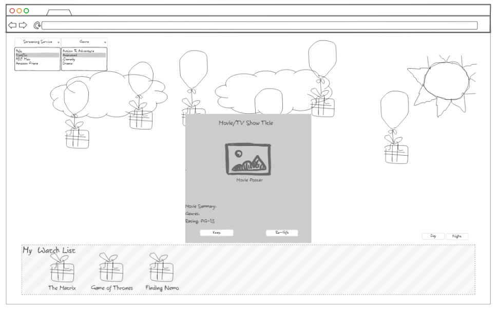

# Getting Started with Create React App

This project was bootstrapped with [Create React App](https://github.com/facebook/create-react-app).

Project Pitch:
The aim of our web application is to alleviate the struggle of trying to decide what to watch. Our application will display several floating balloons with presents attached. Clicking on one of the balloons will then open the present, displaying a suggestion for a movie or series available on a streaming platform to watch. This application will use the Flixed Streaming Metadata API (subject to change depending on if we are granted access or not) to display the title, poster, summary, genre, and rating of each piece of media. Users can filter their suggestions by genre and/or streaming service. The user will be able to select to “keep” or “re-gift” their suggestion. If “keep” is selected, the application will add it to a watch list section. 

Framework/Mockup:

    User Stories: 
- As a user, I should be able to view six floating presents attached to balloons on the page. 
- As a user, I should be able to filter my options by selecting the genre and streaming platform of choice from a dropdown menu. 
- As a user, I should be able to click on the balloon attached to the present so that the present will “open” and display a movie/series suggestion.
- As a user, I should be able to click a “keep” or “re-gift” button for each suggestion. 
- As a user, I should be able to add a movie/series to my watch list by clicking the “keep” button. 
	
    Advanced Deliverables:
- As a user, I should be able to toggle the background image between a “night” and a “day” sky. 

